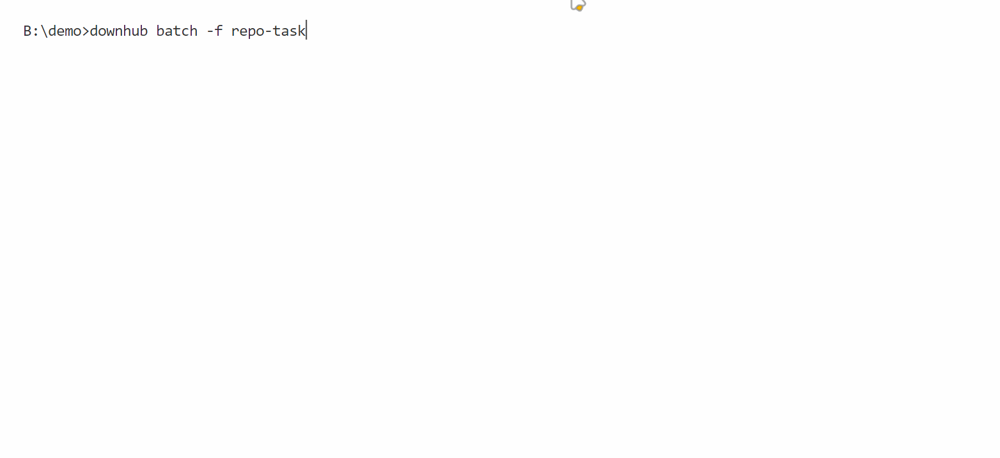

# Github Release 快捷下载

`DownHub` 是一个用于从 GitHub 快速下载发布版本的命令行工具。

## 📦 安装

使用以下命令安装 `DownHub`：

```shell
go install github.com/Fromsko/downhub@latest
```

安装完成后，您可以通过以下命令来运行它：

```shell
downhub
```

## 📷 截屏

- 命令行参数:

<div align="center">
 
</div>

- 单个仓库下载:

<div align="center">
 
</div>

- 批量下载:
<div align="center">
 
</div>

## 💻 开发

如果您想参与此项目的开发，可以按照以下步骤设置开发环境：

1. 克隆仓库：

   ```shell
   git clone https://github.com/Fromsko/downhub.git
   cd downhub
   ```

2. 构建项目：

   ```shell
   go build
   ```

3. 运行：

   ```shell
   ./downhub
   ```

欢迎提交 Pull Requests 和 Issues！

## 🙏 鸣谢

感谢以下开源项目，它们为本项目的开发提供了重要支持：

- [Colly](https://github.com/gocolly/colly): 🕸️ 用于网页爬取的 Go 语言库。
- [Cobra](https://github.com/spf13/cobra): 🐍 用于创建强大的命令行界面的 Go 语言库。
- [ants](https://github.com/panjf2000/ants): 🐜 一个高性能和低成本的 Go 语言协程池。
- [progressbar](https://github.com/schollz/progressbar): 📊 用于 Go 语言中的进度条显示。

## ©️ 许可

此项目遵循 [MIT 许可](LICENSE)。
