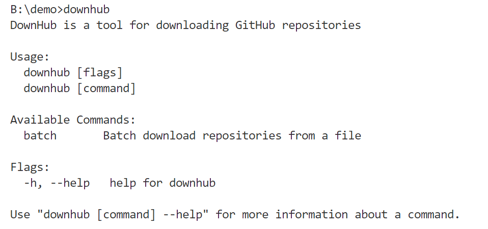

# DownHub - Github Release 快捷下载工具

DownHub 是一个用于从 GitHub 快速下载发布版本（Release）的命令行工具，支持单仓库和批量下载，支持代理，支持多文件并发下载与美观的多进度条展示。

---

## ✨ 功能特性

- 支持下载指定仓库所有 Release 的 zip/tar.gz 包
- 支持批量下载（通过文件列表）
- 支持 HTTP/HTTPS 代理，自动检测 GitHub 连接
- 多文件并发下载，进度条美观直观
- 下载完成后统计成功/失败数与存放目录
- 彩色日志输出，时间+级别清晰
- 支持YAML配置文件，可自定义下载行为和默认设置
- 支持文档文件下载（.md, .txt等）
- 支持通过YAML配置文件管理多个仓库的下载任务
- 支持文件过滤器，可自定义包含或排除特定文件
- 支持断点续传和下载重试机制
- **智能目录结构**：自动按 `data/source/owner/repo` 结构组织下载文件
- **OpenSpec 支持**：支持规范驱动的开发和变更管理

---

## 📦 安装

```sh
git clone https://github.com/Fromsko/downhub.git
cd downhub
go build -o downhub main.go
```

---

## 🚀 快速开始

### 单仓库下载

```sh
./downhub https://github.com/gin-gonic/gin
```

### 使用代理

```sh
# 使用配置文件中的代理设置
./downhub https://github.com/gin-gonic/gin

# 或手动指定代理
./downhub --proxy http://localhost:7897 https://github.com/gin-gonic/gin
```

### 批量下载

准备一个包含多个仓库地址的文本文件（每行一个）：

```txt
https://github.com/gin-gonic/gin
https://github.com/labstack/echo
...
```

执行批量下载：

```sh
./downhub batch -f repo-list.txt
```

### 文档下载

下载指定仓库的文档文件：

```sh
./downhub docs https://github.com/gin-gonic/gin
```

指定输出目录：

```sh
./downhub docs https://github.com/gin-gonic/gin -o ./my-docs
```

指定文档路径：

```sh
./downhub docs https://github.com/gin-gonic/gin -d documentation
```

### 配置文件管理

使用配置文件管理多个仓库：

```sh
./downhub common
```

---

## ⚙️ 命令行参数

- `-p, --proxy` 指定代理地址（如 http://localhost:7897）
- `batch -f` 批量下载，指定包含仓库地址的文件
- `docs` 下载文档文件
- `common` 使用配置文件批量下载
- `-h, --help` 查看帮助



---

## 📁 目录结构

DownHub 自动按以下结构组织下载文件：

```
downhub/
├── data/
│   ├── source/          # 源代码包
│   │   └── gin-gonic/
│   │       └── gin/     # gin-gonic/gin 的所有版本
│   │           ├── v1.8.0.tar.gz
│   │           ├── v1.8.0.zip
│   │           └── ...
│   └── docs/            # 文档文件
│       └── gin-gonic/
│           └── gin/
│               ├── README.md
│               ├── CHANGELOG.md
│               └── ...
└── downhub.yaml         # 配置文件
```

---

## 🖥️ 进度与日志

- 每个文件下载均有独立进度条，支持多文件并发美观展示
- 日志输出带时间戳，级别彩色区分，便于排查问题
- 下载结束后自动统计总数、成功、失败、存放目录
- 智能代理检测，自动选择直连或代理访问


---

## 🛠️ 开发&贡献

欢迎提交 PR 或 Issue！

1. 克隆仓库
   ```sh
   git clone https://github.com/Fromsko/downhub.git
   cd downhub
   ```
2. 构建

   ```sh
   go build -o downhub main.go
   ```

3. 运行

   ```sh
   ./downhub --help
   ```

---

## 🙏 鸣谢

- [Colly](https://github.com/gocolly/colly) 网页爬取
- [Cobra](https://github.com/spf13/cobra) 命令行解析
- [mpb](https://github.com/vbauerster/mpb) 多进度条
- [fatih/color](https://github.com/fatih/color) 彩色日志

---

## 🛠️ 配置文件

DownHub 支持通过 YAML 配置文件进行自定义设置。首次运行时，如果不存在配置文件，程序会自动创建一个默认配置文件 `downhub.yaml`。

### 配置文件示例

```yaml
# Downhub Configuration File

defaults:
  base_data_dir: "data"
  docs_dir: "docs"
  source_dir: "source"
  docs_path: "docs"
  max_concurrent_downloads: 5
  proxy: "http://localhost:7897"

repositories:
  - name: "gin-gonic"
    url: "https://github.com/gin-gonic/gin"
    download_docs: true
    download_source: true
    docs_path: "docs"

file_filters:
  include:
    - "*.md"
    - "*.txt"
    - "*.yaml"
    - "*.yml"
    - "*.json"
  exclude:
    - "node_modules/*"
    - ".git/*"
    - "vendor/*"
    - "*.log"
    - "*.tmp"

download:
  timeout: 300
  retries: 3
  retry_delay: 5
  user_agent: "DownHub/1.0"

logging:
  level: "info"
  format: "text"
  output: "stdout"

advanced:
  preserve_structure: true
  create_readme: true
  validate_checksums: false
```

### 配置选项详解

- `defaults`: 默认设置
  - `base_data_dir`: 基础数据目录，所有下载文件的根目录
  - `docs_dir`: 文档目录名称（相对于 base_data_dir）
  - `source_dir`: 源代码目录名称（相对于 base_data_dir）
  - `docs_path`: 默认文档路径，在仓库中查找文档的默认路径
  - `max_concurrent_downloads`: 最大并发下载数，控制同时下载的文件数量
  - `proxy`: 默认代理地址，支持自动检测 GitHub 连接

- `repositories`: 仓库配置列表
  - `name`: 仓库名称
  - `url`: 仓库URL
  - `download_docs`: 是否下载文档文件
  - `download_source`: 是否下载源代码包
  - `docs_path`: 该仓库的文档路径

- `file_filters`: 文件过滤器
  - `include`: 包含的文件模式，只有匹配这些模式的文件才会被下载
  - `exclude`: 排除的文件模式，匹配这些模式的文件将被忽略

- `download`: 下载设置
  - `timeout`: 下载超时时间（秒）
  - `retries`: 下载失败时的重试次数
  - `retry_delay`: 重试之间的延迟时间（秒）
  - `user_agent`: HTTP请求使用的用户代理字符串

- `logging`: 日志配置
  - `level`: 日志级别（debug, info, warn, error）
  - `format`: 日志格式（text, json）
  - `output`: 日志输出位置（stdout, stderr, file）

- `advanced`: 高级设置
  - `preserve_structure`: 是否保持仓库目录结构
  - `create_readme`: 是否为每个下载的仓库创建README文件
  - `validate_checksums`: 是否验证文件校验和

---

## 🆕 v1.8 更新内容

### 🔧 修复内容
- **代理配置修复**：修复代理端口配置，支持正确的代理设置
- **目录结构优化**：修复下载目录结构，确保文件按 `data/source/owner/repo` 组织
- **智能连接检测**：优先尝试直连 GitHub，失败后自动使用代理
- **代码质量改进**：修复 lint 错误，提升代码质量

### 🚀 新增功能
- **文档下载增强**：改进文档下载功能，支持更多文件类型
- **OpenSpec 集成**：支持规范驱动的开发和变更管理
- **配置文件优化**：改进配置文件结构和默认设置

### 📈 性能优化
- **并发下载优化**：改进并发下载逻辑，提升下载效率
- **内存使用优化**：优化内存使用，减少资源占用

## 📄 License

MIT
